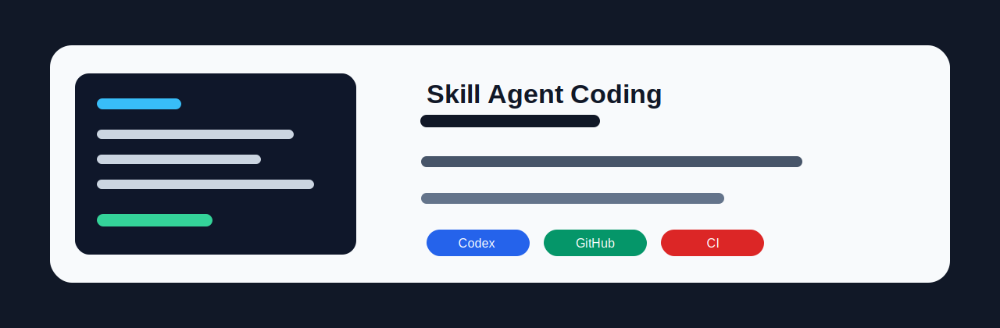
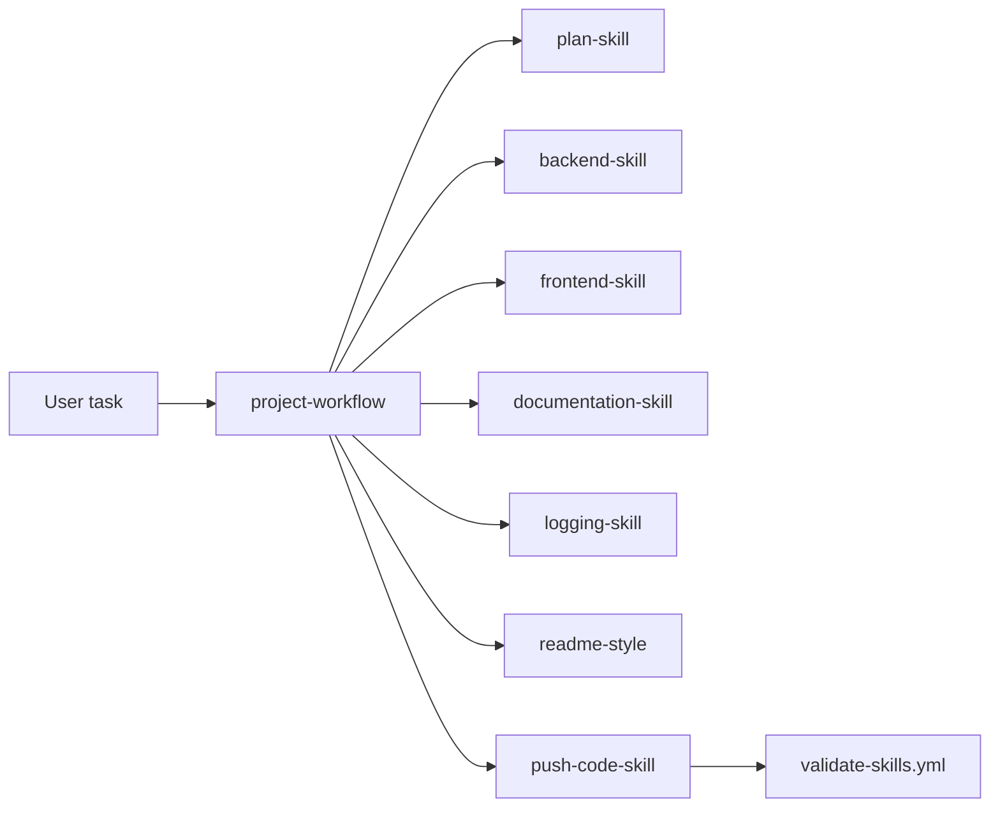

<div align="center">
  

  # Skill Agent Coding

  A repository of Codex and GitHub skill rules for consistent project planning, implementation, documentation, logging, README writing, and push workflow checks.

  
  
  

  [Skill Map](#skill-map) | [Repository Flow](#repository-flow) | [Validation](#validation) | [Repository Map](#repository-map)
</div>

## Overview

This repo keeps project workflow rules in two places:

| Area | Purpose |
| --- | --- |
| `.codex/skills` | Discoverable Codex skills. Each skill directory has a `SKILL.md` file with `name` and `description` metadata. |
| `.github/skills` | GitHub-facing mirror of the same project rules. |
| `.codex/skills/project-workflow` | Coordinator skill that points to preserved source rules and explains which rule file to read for each task type. |

## Skill Map

| Skill | Use |
| --- | --- |
| `backend`, `backend-skill` | Backend structure, naming, API, service, testing, security, and cleanup rules. |
| `frontend`, `frontend-skill` | UI structure, component, accessibility, SEO, performance, and browser compatibility rules. |
| `plan`, `plan-skill` | Task planning, phase tracking, documentation, logging, and push preparation. |
| `docs`, `documentation-skill` | Project docs storage, summaries, cleanup, and timestamp rules. |
| `log`, `logging-skill` | Work-session logs for task progress and outcomes. |
| `push`, `push-code-skill` | CI/CD scan, README/setup checks, commit description, versioning, and push process. |
| `readme`, `readme-style` | README layout, banner, badges, architecture flow, quick start, and accuracy notes. |
| `project-workflow` | High-level coordinator for the complete project workflow. |

## Repository Flow



Short aliases are included so `/backend`, `/push`, `/frontend`, `/plan`, `/docs`, `/log`, and `/readme` work in tools that expose user-invocable skills as slash commands.

## Validation

Run the same structural checks used by CI:

```powershell
$ErrorActionPreference = "Stop"
Get-ChildItem ".codex/skills" -Directory | ForEach-Object {
  $skillFile = Join-Path $_.FullName "SKILL.md"
  if (!(Test-Path $skillFile)) { throw "Missing SKILL.md in $($_.FullName)" }
  if (!(Select-String -Path $skillFile -Pattern "^name:\s*.+" -Quiet)) { throw "Missing name in $skillFile" }
  if (!(Select-String -Path $skillFile -Pattern "^description:\s*.+" -Quiet)) { throw "Missing description in $skillFile" }
  if (!(Select-String -Path $skillFile -Pattern "^user-invocable:\s*true\s*$" -Quiet)) { throw "Missing user-invocable true in $skillFile" }
}
```

The official `skill-creator` validator can also be used when the local Python environment has `PyYAML` installed.

## Repository Map

| Path | Description |
| --- | --- |
| `.codex/skills/<skill>/SKILL.md` | Top-level discoverable Codex skill wrappers. |
| `.codex/skills/project-workflow/references/github-skills` | Preserved detailed source rules. |
| `.github/skills/<skill>/SKILL.md` | GitHub skill mirror entrypoints. |
| `.github/workflows/validate-skills.yml` | CI check for skill structure and metadata. |
| `docs/` | Task documentation and supporting assets. |
| `logs/` | Work-session logs. |
| `plans/` | Task plans. |

## Notes On Accuracy

This repository stores workflow guidance, not application source code. CI validates skill structure and metadata only; it does not prove the content of every rule is complete for every future project.
