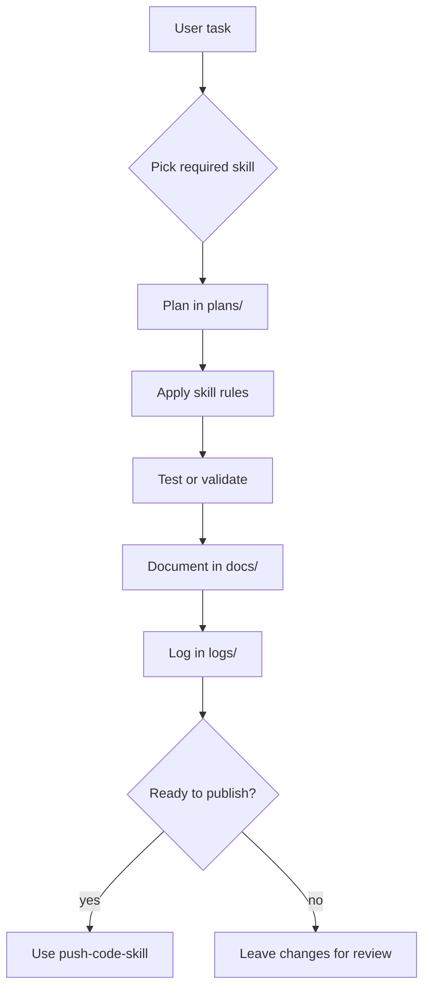

<div align="center">

# Skill Agent Coding

**A compact, multi-runtime skill library for Claude Code, Codex, and GitHub skill workflows.**


[Overview](#overview) · [Skill Matrix](#skill-matrix) · [Workflow](#workflow) · [Quick Start](#quick-start) · [Repo Map](#repository-map) · [Docs](#docs-index) · [Accuracy](#notes-on-accuracy)

</div>

---

## Overview

`skill-agent-coding` stores reusable agent rules as plain Markdown skill packages. The repo keeps parallel skill trees for the environments that consume them:

| Runtime root | Purpose |
| --- | --- |
| `.claude/skills/` | Claude Code skill source used in local Claude workflows. |
| `.codex/skills/` | Codex-compatible skill source. |
| `.github/skills/` | GitHub-hosted skill source and repository validation target. |

Each skill is intentionally small: a `SKILL.md` entrypoint plus optional focused Markdown files for larger domains such as frontend design, testing, and security.

## Skill Matrix

| Skill | Current role | Notes |
| --- | --- | --- |
| `backend-skill` | Backend/API/service/database rules. | Single-file skill. |
| `frontend-skill` | Frontend/UI/state/API client rules. | Points UI design work to `frontend-design-skills`. |
| `frontend-design-skills` | Visual design, layout, typography, color, interaction, accessibility. | Multi-file supporting skill. |
| `testing-skill` | Test strategy, UI tests, backend tests, logic tests, edge cases, benchmark, logs/docs. | Multi-file skill. |
| `security-skill` | Production security, OWASP-style review, auth, data, infra, supply chain, gates. | Multi-file skill. |
| `plan-skill` | Phase-based task planning workflow. | Requires `plans/` task plans. |
| `documentation-skill` | Project documentation rules. | Requires docs under `docs/`. |
| `logging-skill` | Work-session logging rules. | Requires logs under `logs/`. |
| `push-code-skill` | Commit, push, CI/CD, release-readiness rules. | Use before publishing changes. |
| `readme-style` | README layout and content style guide. | Used for this README format. |

## Workflow



## Quick Start

Clone or open the repository, then validate that each runtime skill directory has a valid `SKILL.md` entrypoint.

```powershell
$ErrorActionPreference = "Stop"
foreach ($root in @(".claude/skills", ".codex/skills", ".github/skills")) {
  Get-ChildItem $root -Directory | ForEach-Object {
    $skillFile = Join-Path $_.FullName "SKILL.md"
    if (!(Test-Path $skillFile)) { throw "Missing SKILL.md in $($_.FullName)" }
    if (!(Select-String -Path $skillFile -Pattern "^name:\s*.+" -Quiet)) { throw "Missing name in $skillFile" }
    if (!(Select-String -Path $skillFile -Pattern "^description:\s*.+" -Quiet)) { throw "Missing description in $skillFile" }
    if (!(Select-String -Path $skillFile -Pattern "^user-invocable:\s*true\s*$" -Quiet)) { throw "Missing user-invocable true in $skillFile" }
  }
}
```

## Application Pipelines

| Pipeline | Input | Output |
| --- | --- | --- |
| Coding task | User request + relevant skill | Implementation rules and verification checklist. |
| Planning task | Any non-trivial task | `plans/plan-*.md` with phases, timing, resources, and required skills. |
| Documentation task | Completed change or docs request | Concise dated docs under `docs/`. |
| Logging task | Work-session or task result | Concise dated logs under `logs/`. |
| Release task | Commit, push, PR, CI/CD request | Git status/diff checks, test evidence, and push workflow. |

## Repository Map

```text
.claude/
  settings.json
  skills/
    <skill-name>/
      SKILL.md
      *.md
.codex/
  skills/
    <skill-name>/
      SKILL.md
      *.md
.github/
  skills/
    <skill-name>/
      SKILL.md
      *.md
  workflows/
    validate-skills.yml
docs/
  task/
    *.md
logs/
  documentation/
    *.md
plans/
  plan-*.md
README.md
```

## Docs Index

| Path | Purpose |
| --- | --- |
| `docs/task/` | Task-level documentation summaries created after documentation-related work. |
| `logs/documentation/` | Session/task logs for documentation and README work. |
| `plans/` | Phase plans required by `plan-skill`. |
| `.github/workflows/validate-skills.yml` | Repository validation workflow for skill metadata. |

## Operating Notes

- Keep `.claude`, `.codex`, and `.github` skill content aligned when a skill is meant to work in all runtimes.
- Large skills should split supporting rules into focused Markdown files instead of making `SKILL.md` too long.
- Update this README when adding or removing top-level skills.
- Use `documentation-skill` and `logging-skill` for task records, but keep them concise.
- Use `push-code-skill` before committing or pushing repository changes.

## Notes On Accuracy

- This README describes the repository state as of 2026-05-17.
- It does not claim that every skill has identical content across every runtime root; verify diffs before release.
- `docs/`, `logs/`, and `plans/` are workflow records, not runtime skill entrypoints.
- Security and testing skills are guidance/checklist skills; they do not replace real project-specific tests, scans, or production security review.
